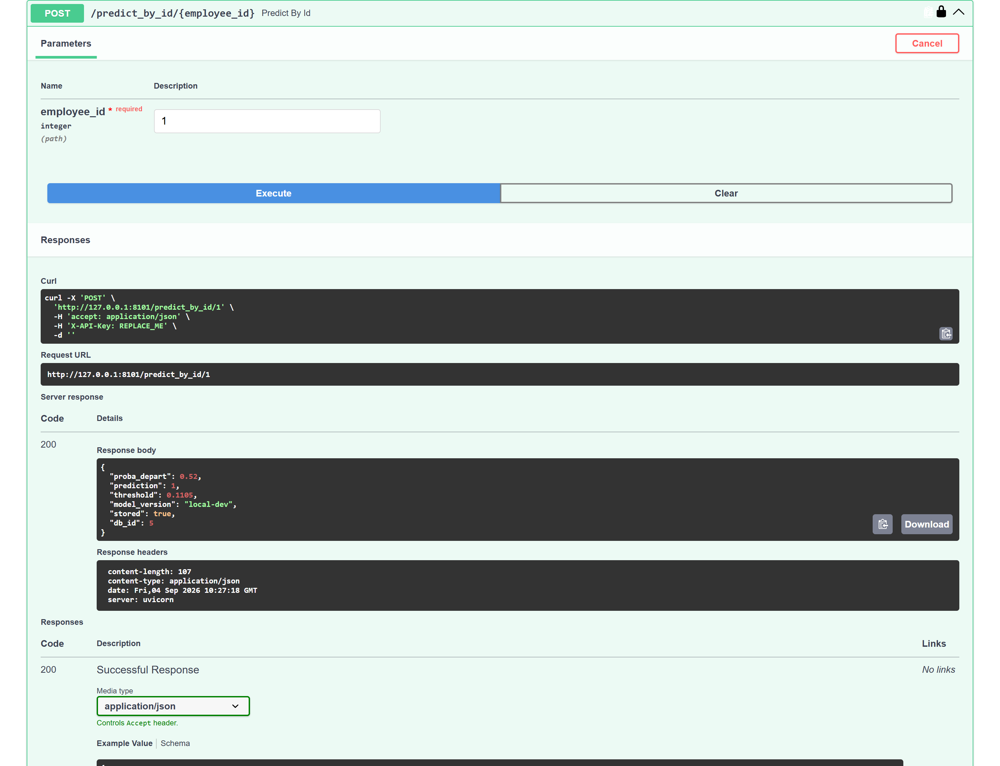
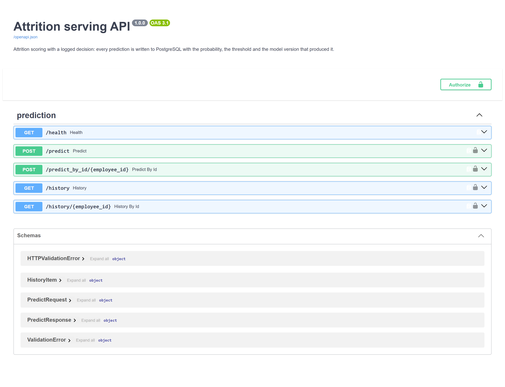

# Attrition serving — a decision, logged

An HR attrition model behind a FastAPI service, with every prediction written to PostgreSQL
alongside the probability, the threshold and the model version that produced it, and a
continuous deployment to a container host.

This repository is one of two in this portfolio that serve a tabular model behind an API.
The other, `lab-credit-scoring-mlops`, carries Prometheus instrumentation and a drift
module. **This one carries the traceability**: a schema, a history endpoint, and a row per
decision. They deliberately do not duplicate each other.

The model is a logistic regression. The interesting part is what it took to make its
published numbers true.

## Project status

**Deliberately finished.** Built, audited, rebuilt around the audit, then reviewed from the
outside and rebuilt around what survived arbitration. Not maintained beyond that, and its CI
does not run on a schedule.

Concretely:

- every figure below is read from a file in `reports/`, written by a script in `scripts/`;
- the model is evaluated by 5×5 repeated cross-validation over all 1,470 rows, and every
  number is published with the spread it has;
- the threshold is chosen from a cost curve, with the cost ratio stated;
- what the data cannot settle is at the end, not buried.

## The result

| | Average precision | ROC AUC | ECE | Mean predicted |
|---|---|---|---|---|
| raw scores | **0.607 ± 0.058** | 0.823 ± 0.029 | 0.214 | 0.375 |
| isotonic, held-out fit | 0.551 ± 0.057 | 0.817 ± 0.030 | 0.020 | 0.164 |
| **isotonic, cross-fitted — shipped** | 0.569 ± 0.058 | 0.820 ± 0.028 | **0.015** | 0.163 |

Base rate: 0.161. Twenty-five folds, 7,350 scored rows, 1,185 departures.

The shipped operating point is **threshold 0.110 on the calibrated scale**, the expected-cost
optimum when one missed departure is worth eight unnecessary retention conversations. At that
point the service alerts on 37% of employees and catches 78% of departures. Move the ratio
and the answer moves with it — `reports/cost_curve.csv` publishes eight of them.



## What was wrong, and what it cost

Six defects. Every one of them is in what the repository *published*, not in what it
computed, and each is given with the number before and the number after.

### The service decided at a threshold nothing documented

`api/settings.py` read `model_card["threshold_default"]`. The export script writes
`default_threshold`. The lookup missed on every request and fell back to `0.5` — and
`.env.example`, the file the documentation says to copy, also set `MODEL_THRESHOLD=0.5`. Both
routes to the threshold led to a value nothing justified, while every published figure said
0.32.

Measured on the test set of the day:

| Threshold | Precision | Recall | Missed departures |
|---|---|---|---|
| **0.500 — what the service used** | 0.319 | **0.625** | **9 of 24** |
| 0.320 — what the model card said | 0.274 | 0.833 | 4 of 24 |

A missing key, and the deployed service found two-thirds of what its own documentation
promised. A missing threshold is now an error rather than a silent default: serving an
undocumented operating point is worse than refusing to start. A test loads the card, calls
the service, and fails if the two disagree.

### The threshold was chosen on the test set

`find_threshold_for_recall(y_test, p_test, target_recall=0.80)`. The recall of 0.80 was not a
property of the model; it was the definition of the threshold, measured on the same 147 rows
that then reported it.

The threshold is now selected inside each fold, on a validation split the scoring fold never
sees. **The optimism this removes is +0.007 of recall** — small. That is worth saying plainly:
the leak was real, and its effect on the point estimate was not large. What it removed was
the guarantee, not the number.

### Everything rested on 24 events

The split was 90/10: 1,323 training rows, 147 test rows, **24 departures**. Bootstrapped over
2,000 resamples, that test set gives:

| | Value | 95% interval | Width |
|---|---|---|---|
| average precision | 0.546 | [0.355 ; 0.726] | 0.371 |
| ROC AUC | 0.788 | [0.681 ; 0.882] | 0.201 |
| recall at 0.32 | 0.833 | [0.667 ; 0.962] | 0.295 |

"Recall = 0.80" was indistinguishable from 0.70 and from 0.95. The repository published four
decimal places on that basis.

Replaced by 5×5 repeated stratified cross-validation over all 1,470 rows. And the comparison
runs the other way from what you would expect: the published split gave **0.546 average
precision, above only 16% of the folds**. The repository was under-reporting its own model,
not flattering it.

### Three files, three numbers, no producer

`model_card.json` and `api_model_metrics.json` said 0.32 and AP 0.546. `reports/final_metrics.json`
said 0.3426, AP 0.5536, ROC AUC 0.7991. Re-evaluating the exported pipeline on the same split
gave 0.546 and 0.788 — so the third file described something else, and **no code in the
repository produced it**. It is deleted. One script writes the figures now, and it is the one
the model card cites.

### The probability was not a probability

`class_weight="balanced"` makes the scores rank well and lie. Mean predicted 0.375 against a
base rate of 0.161, expected calibration error 0.214 — and in the bin where the model
predicted 0.57, the observed departure rate was 0.17.

The service returns that number as `proba_depart` and writes it to PostgreSQL under that name.
So it has to be one. Isotonic recalibration, cross-fitted over the training fold, brings ECE
to **0.015**.

It costs average precision, 0.607 to 0.569, and a comment in this code first claimed it could
not: isotonic is monotone, so it cannot reorder anything. **That claim was wrong, and running
the third arm is what caught it.** Isotonic is a *step* function — it maps distinct scores onto
one value, and ties are exactly what average precision penalises. ROC AUC moves from 0.823 to
0.820, which is how you can see the ordering survived. Fitting the calibrator across the whole
training fold rather than on one held-out split recovers a third of the loss, 0.551 to 0.569,
by giving the staircase more steps.

### The API required five fields it did not use

`expected_features.json` was built from every column of the training frame. The pipeline
consumes 32; the API demanded 37. A caller had to send the anonymised employee id and both
join keys to get a prediction, and all three were dropped before the model saw them.

One of the five is the previous pay rise, and the service carefully normalised it into `"11 %"`
on the way in. A salary-increase variable silently absent from an attrition model is worth
checking rather than assuming, so it was: parsed to a number and added back, average precision
goes from 0.608 to 0.604 against a fold spread of 0.056. It changes nothing. The contract was
the defect, and the dead normalisation is gone.

## Who the alerts land on

At the shipped threshold, over the 25 folds:

| Attribute | Group | Base rate | Alert rate | Alert / base | Recall |
|---|---|---|---|---|---|
| gender | 0 | 0.148 | 0.336 | 2.27 | 0.770 |
| gender | 1 | 0.170 | 0.385 | 2.27 | 0.763 |
| marital status | single | 0.255 | 0.503 | 1.97 | **0.858** |
| marital status | divorced | 0.101 | 0.259 | 2.57 | 0.782 |
| marital status | married | 0.125 | 0.322 | 2.58 | **0.626** |
| department | Sales | 0.206 | 0.447 | 2.17 | 0.789 |
| department | Consulting | 0.138 | 0.322 | 2.32 | 0.744 |
| department | HR | 0.190 | 0.457 | 2.40 | 0.817 |

The alert-to-base ratio is between 2.0 and 2.6 everywhere: no group is alerted on more than
its actual departure rate warrants. **Recall is not so even.** The model finds 86% of
departures among single employees and 63% among married ones. A retention programme built on
it would systematically catch fewer departures in one group than another, and that is a
property of the model, not of the base rates.

No correction is applied and no fairness claim is made. On 1,470 rows the honest move is to
publish the table.

## Model families, under one protocol

| Model | Average precision | ROC AUC |
|---|---|---|
| constant baseline | 0.161 ± 0.002 | 0.500 |
| **logistic regression** | **0.607 ± 0.058** | 0.823 |
| random forest | 0.531 ± 0.057 | 0.804 |

The constant baseline scores exactly the base rate, which is what "learned nothing" looks
like on a 16% problem — and 0.84 accuracy, which is why accuracy is not reported anywhere in
this repository. The forest does not beat the linear model on 1,470 rows and 32 features, and
the linear model can be read coefficient by coefficient, which on an HR decision is a
requirement rather than a tie-breaker.

## Running it

```bash
uv sync --group dev --group db --group serve
cp .env.example .env.local          # set API_KEY; leave MODEL_THRESHOLD unset
docker compose up -d                # PostgreSQL
uv run python scripts/db_apply_schema.py
uv run python scripts/db_seed_employees.py
```

Reproduce every published figure — a few minutes, no GPU:

```bash
uv run python scripts/data_quality_report.py   # the data dossier
uv run python scripts/run_evaluation.py        # 3 arms x 25 folds, cost curve, calibration
uv run python scripts/train_export_pipeline.py # the artefact and its card
```

Serve it:

```bash
uv run uvicorn attrition_serving.api.main:app --port 8000
```



`/predict` takes a full feature payload, `/predict_by_id/{id}` scores an employee already in
the database, and `/history` returns what was decided and at which threshold. Every route but
`/health` requires `X-API-Key`.

## Structure

```
├── data/                          # HR records: not committed, only 10 request fixtures
├── docs/                          # API, DB, deployment, runbook, security, testing
├── models/
│   ├── pipeline.joblib            # the shipped model, calibrated
│   ├── model_card.json            # threshold, cost ratio, CV metrics, sklearn version
│   └── expected_features.json     # the 32 features the model consumes
├── notebooks/                     # ingestion, EDA, features, baselines, tuning
├── reports/                       # everything published
│   ├── evaluation_cv.csv          #   one row per fold per arm
│   ├── evaluation_summary.json    #   means, spreads, calibration, the old split compared
│   ├── baselines.csv              #   the three model families
│   ├── cost_curve.csv             #   the threshold each cost ratio implies
│   ├── calibration.csv            #   reliability, equal-population bins, per arm
│   ├── subgroups.csv              #   alert rate and recall per group
│   └── data_quality.csv, cleaning_trace.csv, redundant_features.csv, feature_encoding.csv
├── scripts/                       # data quality, evaluation, export, database
├── sql/                           # views and the serving schema
├── src/attrition_serving/
│   ├── api/                       # FastAPI: routes, settings, dependencies
│   ├── protocol.py                # the evaluation protocol; nothing publishes around it
│   ├── preprocessing.py           # feature groups, nominal and ordinal declared
│   └── ...                        # cleaning, features, modeling, evaluation, db
└── tests/                         # unit and integration; the integration ones skip in 3s
```

## What this still does not prove

**1,470 rows is a small dataset, and 237 departures is a small number of events.** Cross-
validation narrows the intervals; it does not create information. The average precision is
0.607 with a fold-to-fold spread of 0.058, and no comparison finer than that is readable here
— which is why no hyper-parameter search and no gradient boosting appear in this repository.

**The cost ratio is an assumption, not a measurement.** Eight wasted conversations per missed
departure is a number this repository chose to make the threshold explicit, not one an
employer supplied. The curve is published so the choice can be moved; the shipped threshold
is only as defensible as that ratio.

**Nothing here establishes cause.** A variable that separates leavers from stayers may be a
symptom of the decision to leave rather than a reason for it, and a cross-section cannot tell
the two apart. The model ranks risk; it does not name levers.

**No drift monitoring.** That is what the twin repository carries, and duplicating it would
erase the reason for keeping both. A model served without it should be re-evaluated on new
data before being trusted a year from now.

**The subgroup table is a description, not a guarantee.** It shows a recall gap between
married and single employees. It does not establish why, and nothing here corrects it.

## Licence and data

MIT, for the code.

The HR extracts are **not** in this repository. They are records about real employees, and a
portfolio is a public place; `data/` holds only ten rows kept as request fixtures for the API
tests, and employee identifiers are anonymised with HMAC-SHA256 under a key that lives in the
environment. Every figure above can be reproduced from the scripts once the extracts are put
back in `data/raw/`.
