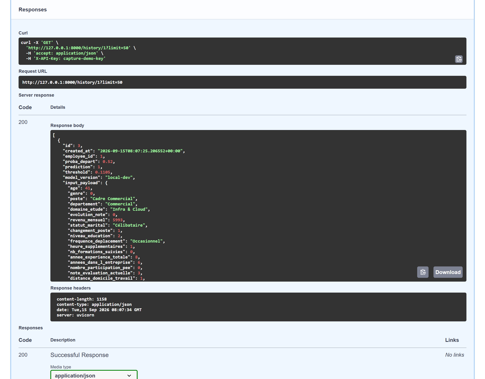
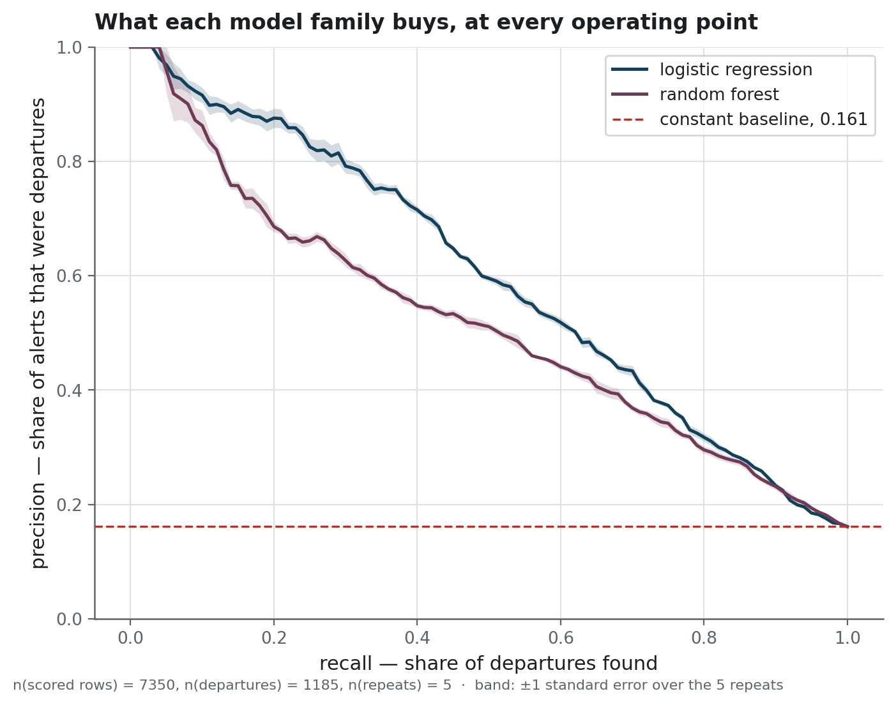
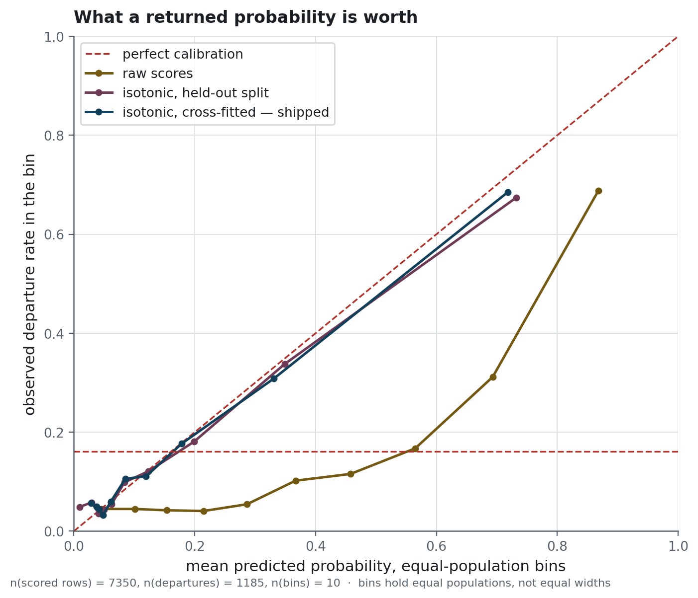
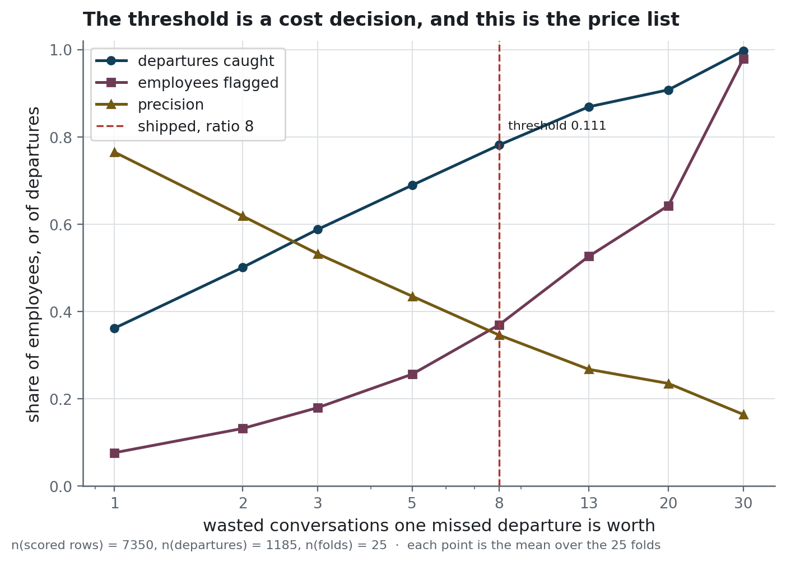
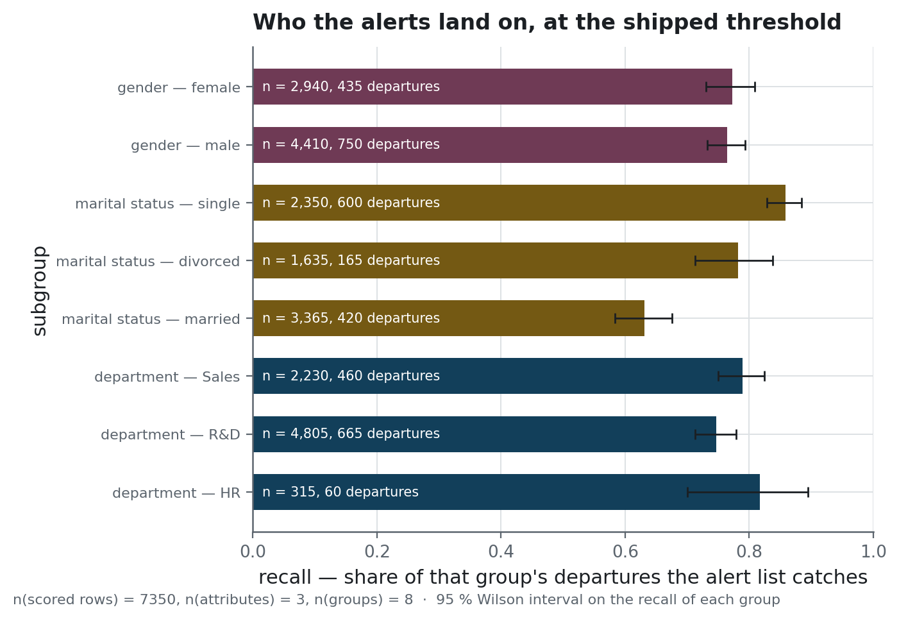
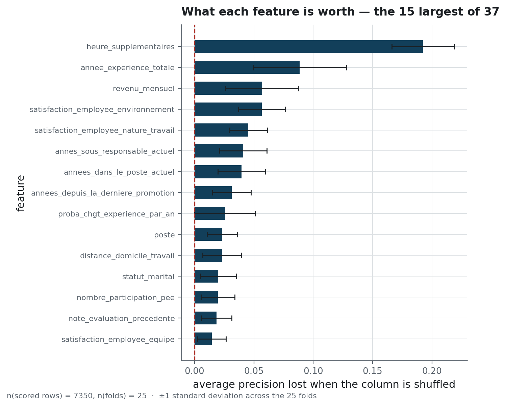

<h1 align="center">Attrition serving</h1>

<p align="center">An HR attrition model behind an API that writes down every decision, with the threshold that made it</p>

<p align="center">
  
  
  
  
</p>

**Project status** — finished, and archived in a runnable state. Churn prediction is the
problem; MLOps is the subject. The model is small, and what is worth reading is the machinery
around it: the frozen artefact, the decision log, the pipeline that keeps them honest. The hosted deployment and the
managed database it wrote to are both gone; `docker compose up` brings the local equivalent
back in one command. Continuous integration runs on push and on pull requests, against a real
PostgreSQL service container.

## The problem

An HR team that wants to keep people has to know who is about to go, early enough to talk to
them. A model can rank employees by risk. It cannot say from which score a conversation starts,
because that line depends on something the model does not know: what a departure costs
compared to an hour spent on a retention conversation nobody needed.

Set the line high and the list is short and mostly right, and most of the people who leave are
not on it. Set it low and you catch nearly everyone, on a list so long that no HR team works
through it.

So this repository is built around two questions a model alone does not answer. **At what
threshold should it decide, and who can check that it decided there?**

The data is 1 470 employees, joined on the employee from three extracts: contract and
demographics, annual reviews, an internal survey. 237 of them left, a base rate of 16 %. That imbalance
is why accuracy appears nowhere below: on a churn-prediction problem with that balance,
predicting "stays" for everyone scores 84 % and finds nobody.

## What it does

A FastAPI service loads a calibrated logistic regression and exposes five routes. `/predict`
scores a full feature payload, `/predict_by_id` scores an employee already in the database,
`/history` returns what was decided and when.

Every prediction writes a row to PostgreSQL: the probability, the threshold that turned it into
a decision, and the version of the model that produced it. That is the part worth looking at. A
probability on its own does not let anyone reconstruct, six months later, why a particular
person was flagged. Churn prediction is exactly the kind of decision that gets questioned
six months later, by someone who was not in the room.

<!-- source: docs/images/MANIFEST.json -->


Upstream of the service, three extracts are joined and cleaned into a Parquet frame, and the
data dossier that goes with it carries univariate tests computed with statsmodels: which
columns separate leavers from stayers at all, before any model is fitted.

<!-- source: docs/images/MANIFEST.json -->


### How it is built

**Pydantic** holds the request and response contract, so the OpenAPI page is generated from
the code instead of being maintained beside it, and **Uvicorn** serves it. **SQLAlchemy** with
psycopg writes the decision log, append-only, keeping the payload as JSONB so a feature added
later needs no migration. The model is **scikit-learn**: a logistic regression,
isotonic-recalibrated, exported once to a joblib artefact with a card beside it that carries
the threshold the service must read.

**SHAP** reads one nominative decision at a time in the notebooks, where **MLflow** tracks the
exploratory runs. Neither is on the serving path, and the image installs neither: what is
served is one frozen artefact and the code that reads it.

The tooling around it: **uv** locks the environment, **Ruff** and **Bandit** gate every push,
and **pytest** is split by tier — the last of which boots the service as its own process and
sends it a hundred payloads over HTTP. **Docker** builds the image, and the **GitHub Actions**
pipeline stands a real database up so the middle tier runs instead of skipping.

## The result

<!-- source: reports/figures/MANIFEST.json -->


<!-- source: reports/evaluation_summary.json -->
Twenty-five folds, 7 350 scored rows, 1 185 departures. **Average precision is 0.607 ± 0.058**,
n = 7 350, where a model that learns nothing scores 0.161. The `±` is the fold-to-fold standard
deviation; [`docs/protocol.md`](docs/protocol.md) defines every name on this page and says how
the folds are built.

<!-- source: reports/evaluation_summary.json -->
The scores that ship are not those. Raw, **the model predicted an average risk of 0.375 where
0.161 of employees left**, over the same n = 7 350 rows: it ranked well and its numbers meant
nothing. Recalibration fixes the scale at a cost, 0.607 of average precision down to 0.569, and
the reliability curve below is what that bought.

<!-- source: reports/figures/MANIFEST.json -->


<!-- source: reports/figures/MANIFEST.json -->


<!-- source: reports/cost_curve.csv -->
**The shipped operating point is a threshold of 0.111**, over n = 7 350 scored rows: 37 % of
employees on the list, 78 % of the departures caught. It minimises expected cost when one
missed departure is worth eight wasted conversations, which is a hypothesis and not a
measurement — the curve prices the seven other ratios, and an employer arriving with their own
reads the line they need.

<!-- source: reports/figures/MANIFEST.json -->


<!-- source: reports/subgroups.csv -->
Each group is alerted on at about twice the rate at which it leaves, so the list does not
concentrate anywhere the departures do not. Recall is the uneven column: **86 % of departures
found among single employees, 63 % among married ones**, over n = 7 350 scored rows. Nothing is
corrected and nothing is claimed; [`docs/protocol.md`](docs/protocol.md) gives the eight rows
with the events behind each.

<!-- source: reports/figures/MANIFEST.json -->


<!-- source: reports/permutation_importance.csv -->
Shuffling one column costs far more than any other: **overtime is worth 0.193 ± 0.026 of
average precision**, over n = 7 350 scored rows and 25 folds, where the next feature is worth
0.088. The column names are the dataset's own, and `docs/data-source.md` translates them.

## Why these numbers can be believed

They are not the figures this repository published first. Six things were wrong, all six in
what it *claimed* and not in what it computed — the kind of defect a passing test suite does
not catch.

The service decided at a threshold nothing documented, because the settings module read one key
name and the export wrote another; it fell back to 0.5 and found two thirds of what its own
documentation promised. The threshold was chosen on the test set. Everything rested on 24
events in a 90/10 split. Three files gave three different numbers, one of them produced by no
code in the repository. The probability was not a probability. And the API required five fields
it never read.

[`docs/protocol.md`](docs/protocol.md#the-six-things-that-were-wrong) gives each one with what
it was worth, measured both ways round. A correction nobody can check is a claim.

## Running it

```bash
uv sync --group dev --group db --group serve
cp .env.example .env.local          # set API_KEY; leave MODEL_THRESHOLD unset
docker compose up -d                # PostgreSQL
uv run python scripts/db_apply_schema.py
uv run python scripts/db_seed_employees.py
uv run uvicorn attrition_serving.api.main:app --port 8000
```

<!-- source: docs/images/MANIFEST.json -->


Every route except `/health` requires an `X-API-Key` header.
[`docs/operations.md`](docs/operations.md) has the payloads, the container, the pipeline and
what to check when the service answers badly.

The five figures above rebuild from the committed tables, on a clone, with no data:

```bash
uv run python scripts/build_figures.py
```

Recomputing the tables themselves needs the extracts.
[`docs/data-source.md`](docs/data-source.md) says what they are, a public and fictional IBM
dataset, and rebuilds them from the upstream file:

```bash
uv run python scripts/build_extracts.py --source path/to/WA_Fn-UseC_-HR-Employee-Attrition.csv
uv run python scripts/data_quality_report.py   # the data dossier
uv run python scripts/run_evaluation.py        # 3 arms x 25 folds, cost curve, calibration
uv run python scripts/train_export_pipeline.py # the artefact and its card
```

Tests: `uv run pytest`. The coverage floor is checked on every run and never lowered.
[`docs/architecture.md`](docs/architecture.md) says what each tier guarantees, and what else
was decided before it.

## Structure

```
├── data/                    the extracts and what is derived from them; nothing committed
├── docs/
│   ├── architecture.md      engineering decisions, and what was left out
│   ├── data-source.md       what the dataset is, proved column by column
│   ├── operations.md        routes, container, pipeline, secrets, runbook
│   ├── protocol.md          the evaluation protocol, and the six corrections
│   └── DB.md                the schema and the decision log
├── models/
│   ├── pipeline.joblib      the shipped model, calibrated
│   ├── model_card.json      threshold, cost ratio, CV metrics, scikit-learn version
│   └── expected_features.json  the 32 features the model consumes
├── notebooks/               ingestion, EDA, features, baselines, tuning, the protocol
├── reports/                 every published table, and the five figures drawn from them
├── scripts/                 extracts, data quality, evaluation, figures, export, database
├── sql/                     the exploratory views, and the serving schema
├── src/attrition_serving/   api, data, db, modeling, analysis, preprocessing
└── tests/                   unit, integration, system; the integration tier skips in 3 s
```

## What this does not prove

<!-- source: reports/evaluation_summary.json -->
**n = 1 470 rows at a base rate of 0.161.** Repeating the cross-validation narrows the
interval around each number; it adds no information the rows do not hold. Nothing finer than the
0.058 fold-to-fold spread can be distinguished here, which is why no search over hyper-parameters
and no boosted trees appear.

**Eight conversations per missed departure is a hypothesis.** The threshold inherits exactly as
much justification as that figure has, and no more.

**No causal claim.** A column that tells the two groups apart may be downstream of the decision
to leave: someone on their way out stops asking for training. A single cross-section cannot
separate the two, and a ranking of risk is not a list of levers.

**The subgroup table is a description.** It records a recall gap between two marital statuses.
It does not say where the gap comes from, and nothing in the repository closes it.

**Nothing watches for drift.** Before trusting this model on next year's employees, someone
would have to score them and look; `docs/operations.md` names the signal to look at.

## Licence and data

MIT, for the code.

The data is IBM's *HR Analytics Employee Attrition & Performance*. It was generated, not
collected, and no row of it corresponds to a person. The three files under
`data/raw/` are a French-renamed, three-way split of that file, and they are not
redistributed here. [`docs/data-source.md`](docs/data-source.md) proves the correspondence
column by column, and `scripts/build_extracts.py` rebuilds them from the public upstream.

`tests/fixtures/` holds ten rows in request shape for the API tests. Employee identifiers are
anonymised with HMAC-SHA256 under a key from the environment — a demonstration of the practice,
not a protection, since there is nobody to protect.
