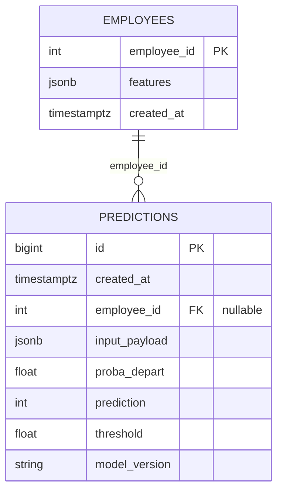

# Database (PostgreSQL) — Serving Schema & Operations

## What this database is for

Traceability. It is the reason this repository exists next to its twin, and it does three
things:

- hold employee features, so `/predict_by_id` can score someone already known;
- record **every** prediction, with the probability, the threshold and the model version
  that produced it;
- expose that history through `/history`.

> The rule the schema enforces: **no decision leaves the service without a row behind it.**
> A model that scores without recording what it scored with cannot be audited after the
> fact, and an HR decision is exactly the kind that gets questioned later.

---

## Schema



## Tables

### 1) employees

A minimal employee profile, as JSONB.

| Column      | Type          | Role                          |
|-------------|---------------|-------------------------------|
| `employee_id` | INTEGER (PK) | stable identifier             |
| `features`    | JSONB        | the model's input features    |
| `created_at`  | TIMESTAMPTZ  | insertion time                |

`/predict_by_id/{employee_id}` reads `features` from here.

### 2) predictions

The decision log. Every call appends a row; nothing is updated in place.

| Column         | Type              | Role                          |
|---------------|-------------------|-------------------------------|
| `id`           | BIGSERIAL (PK)    | prediction id                 |
| `created_at`   | TIMESTAMPTZ       | time of the call              |
| `employee_id`  | INTEGER (FK, nullable) | set when scored by id    |
| `input_payload`| JSONB             | the exact payload scored      |
| `proba_depart` | DOUBLE            | predicted probability, calibrated |
| `prediction`   | SMALLINT          | the decision, 0 or 1          |
| `threshold`    | DOUBLE            | the threshold that decided it |
| `model_version`| TEXT              | the model version that scored |

**Pourquoi `employee_id` nullable ?**
- `/predict` takes a payload directly and has no employee to point at
- `/predict_by_id` takes the id and reads the features from `employees`

**Why JSONB**
- The feature set changes over a model's life. JSONB absorbs that without a migration:
  - the schema does not have to be rewritten when a column is added or dropped
  - a source that adds a field does not break the write
  - and what is stored is what was actually sent, not a projection of it onto the
    columns that existed when the table was designed

**Indexes**
The schema creates:
- one on `predictions.created_at`, for the history endpoint's ordering
- one on `predictions.employee_id`, for the per-employee history
- a GIN index on the JSONB if the payloads are ever queried by content; not needed at
  this volume

---

## Scripts & SQL

### SQL
- `sql/serving/01_schema.sql` — tables and indexes, idempotent
- `sql/serving/02_seed_checks.sql` — inspection queries, optional

### Scripts Python
- `scripts/db_apply_schema.py` — applies `01_schema.sql`; idempotent, so it is safe to rerun
- `scripts/db_seed_employees.py` — seeds the ten request fixtures from `X_test_sample.json`
- `scripts/db_smoke_test.py` — connectivity and row counts
- `scripts/db_run_checks.py` — replays `sql/serving/02_seed_checks.sql` statement by
  statement and prints what each returns; the fastest way to see whether a seed landed
- `scripts/load_raw_to_postgres.py` — loads the three raw extracts into PostgreSQL so the
  exploratory views in `sql/02` to `sql/05` have something to read. It belongs to the
  analysis side, not to serving: the API never touches those tables

### Local, with Docker
**Start PostgreSQL:**
```bash
docker compose up -d
```

**Apply the schema:**
```bash
uv run python scripts/db_apply_schema.py
```

**Seed minimal** :
```bash
uv run python scripts/db_seed_employees.py
```

**Smoke test** :
```bash
uv run python scripts/db_smoke_test.py
```

---

## Seeding policy — these are HR records

The full dataset is never seeded. It describes real employees, and a database that is
brought up by a `docker compose` in a public repository is not the place for it.

What is seeded is a ten-row versioned sample, kept for one reason: to exercise the request
path.
- `data/processed/api_test/X_test_sample.json` (≤10 lignes)

It is used for:
- the API ↔ database integration tests;
- a `/predict_by_id` demonstration.
- Validation rapide en local/CI

---

## Queries worth knowing

### 1) Is the seed there
```sql
SELECT COUNT(*) FROM employees;
```

### 2) Was a prediction logged
```sql
SELECT COUNT(*) FROM predictions;
```

### 3) The most recent decisions
```sql
SELECT id, created_at, employee_id, proba_depart, prediction, threshold, model_version
FROM predictions
ORDER BY created_at DESC
LIMIT 10;
```

**Commande docker pratique** :
```bash
docker exec -it attrition_postgres psql -U attrition -d attrition_serving \
  -c "SELECT id, created_at, employee_id, proba_depart, prediction, threshold, model_version FROM predictions ORDER BY created_at DESC LIMIT 10;"
```

---

## Against a managed PostgreSQL
A managed PostgreSQL usually requires `sslmode=require`:
```
DATABASE_URL=postgresql+psycopg://postgres:<password>@db.<ref>.supabase.co:5432/postgres?sslmode=require
```

Then run the same scripts — `apply_schema`, `seed`, `smoke_test` — against that environment file.

---

## What the log guarantees
- every prediction writes one row, and rows are never updated;
- the exact payload is kept in `input_payload`, so a decision can be replayed against
  the input that produced it rather than against a reconstruction of it;
- `model_version` and `threshold` travel with the probability, so a decision taken six
  months ago can be explained without guessing which model made it. That is the whole
  point: a probability without the threshold that turned it into a decision is not a
  record of anything.
