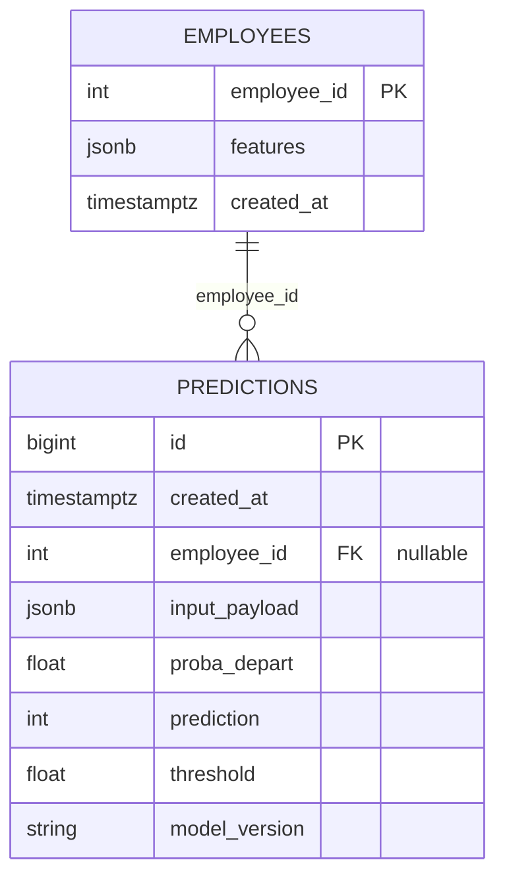

# The database — schema, the decision log, and what each column records

PostgreSQL is here for one reason: **no decision leaves the service without a row behind it.**
A model that scores without recording what it scored with cannot be audited afterwards, and an
HR decision is exactly the kind that gets questioned later.

It does three things: it holds employee features so `/predict_by_id` can score someone already
known, it records every prediction with the probability, the threshold and the model version
that produced it, and it exposes that history through `/history`.

## Schema



### `employees`

A minimal profile, as JSONB. `/predict_by_id/{employee_id}` reads `features` from here.

| Column | Type | Role |
|---|---|---|
| `employee_id` | INTEGER (PK) | stable identifier |
| `features` | JSONB | the model's input features |
| `created_at` | TIMESTAMPTZ | insertion time |

### `predictions`

The decision log. Every call appends a row; nothing is ever updated in place.

| Column | Type | Role |
|---|---|---|
| `id` | BIGSERIAL (PK) | prediction id |
| `created_at` | TIMESTAMPTZ | time of the call |
| `employee_id` | INTEGER (FK, nullable) | set when scored by id |
| `input_payload` | JSONB | the exact payload scored |
| `proba_depart` | DOUBLE | predicted probability, calibrated |
| `prediction` | SMALLINT | the decision, 0 or 1 |
| `threshold` | DOUBLE | the threshold that decided it |
| `model_version` | TEXT | the model version that scored |

**`employee_id` is nullable** because two routes write here: `/predict` takes a payload
directly and has no employee to point at, `/predict_by_id` takes an id and reads the features
from `employees`.

**The payload is JSONB** because the feature set changes over a model's life. JSONB absorbs
that without a migration: a source that adds a field does not break the write, and what is
stored is the payload as it arrived, and not its shadow on whatever columns happened to exist
the day the table was written.

**Indexes.** One on `predictions.created_at` for the history endpoint's ordering, one on
`predictions.employee_id` for the per-employee history. A GIN index on the JSONB would be the
next one if the payloads were ever queried by content; at this volume nothing needs it.

## SQL and scripts

| File | What it does |
|---|---|
| `sql/serving/01_schema.sql` | tables and indexes, idempotent |
| `sql/serving/02_seed_checks.sql` | inspection queries, optional |
| `sql/02_clean_views.sql` … `sql/05_group_stats.sql` | the exploratory views: cleaning, joins, group statistics |
| `scripts/db_apply_schema.py` | applies `01_schema.sql`; safe to rerun |
| `scripts/db_seed_employees.py` | seeds the ten request fixtures |
| `scripts/db_smoke_test.py` | connectivity and row counts |
| `scripts/db_run_checks.py` | replays `02_seed_checks.sql` statement by statement and prints what each returns |
| `scripts/load_raw_to_postgres.py` | loads the three extracts so the exploratory views have something to read |

Those views are analysis, and the API never opens them. They are where the cleaning, the joins and the group statistics were done in SQL
rather than in pandas — 201 lines that answer the same questions the first notebook does, from
the database's side.

## What gets seeded, and what does not

Ten rows, from `tests/fixtures/employees_sample.json`. They exercise the request path: the
API ↔ database integration tests, and a `/predict_by_id` demonstration.

The full extract is not seeded, and not committed. [`data-source.md`](data-source.md) says
what it is, a public and fictional dataset, and how to put it back. A `docker compose` in a
public repository is not where a dataset belongs even when nobody is described by it.

## Queries worth knowing

```sql
SELECT COUNT(*) FROM employees;     -- is the seed there
SELECT COUNT(*) FROM predictions;   -- was anything logged

SELECT id, created_at, employee_id, proba_depart, prediction, threshold, model_version
FROM predictions
ORDER BY created_at DESC
LIMIT 10;
```

From the host, without a psql client:

```bash
docker exec -it attrition_postgres psql -U attrition -d attrition_serving \
  -c "SELECT id, created_at, employee_id, proba_depart, prediction, threshold, model_version FROM predictions ORDER BY created_at DESC LIMIT 10;"
```

## What the log guarantees

Every prediction writes one row, and rows are never updated. The exact payload is kept in
`input_payload`, so a decision can be replayed against the input that produced it and not
against a reconstruction of it. `model_version` and `threshold` travel with the probability,
so a decision taken six months ago can be explained without guessing which model made it.

That is the whole point of the table. A row that held the probability alone would record an
opinion, not a decision.
